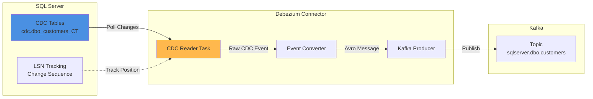
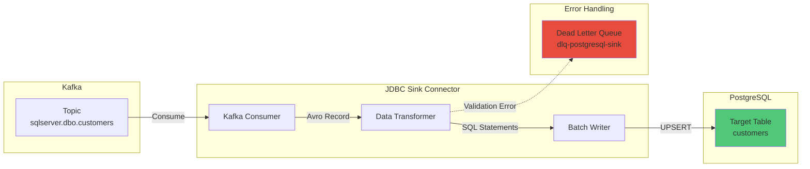
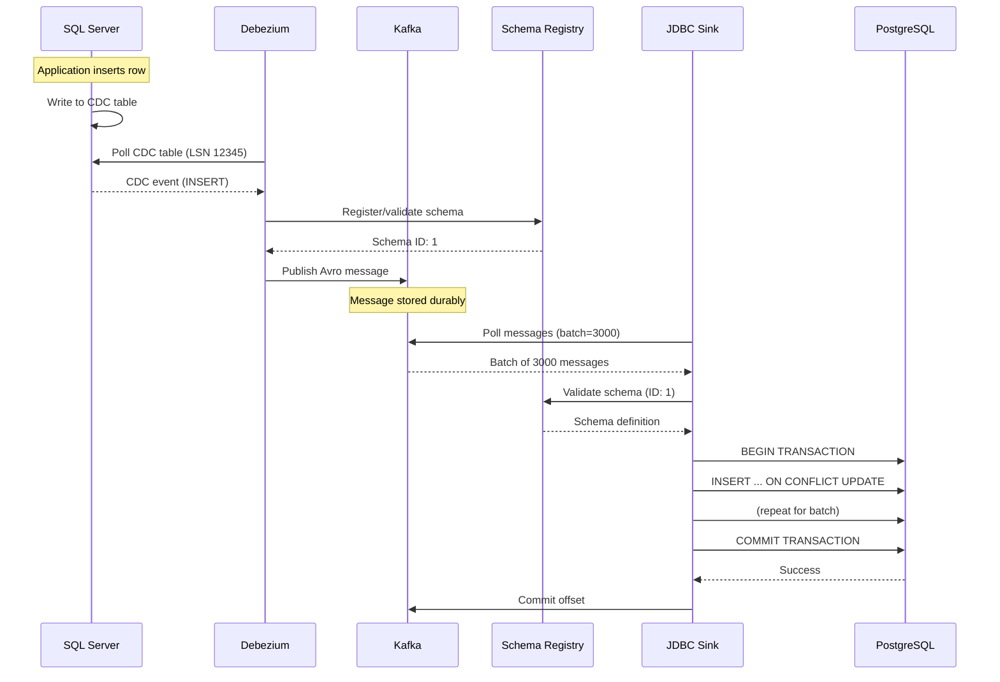
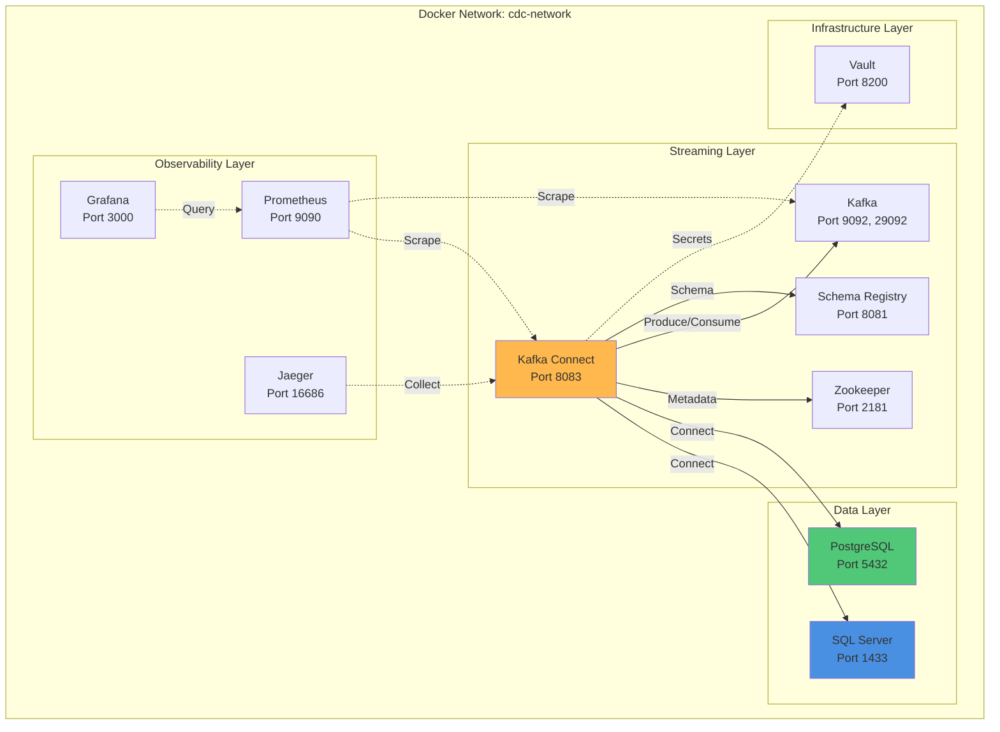
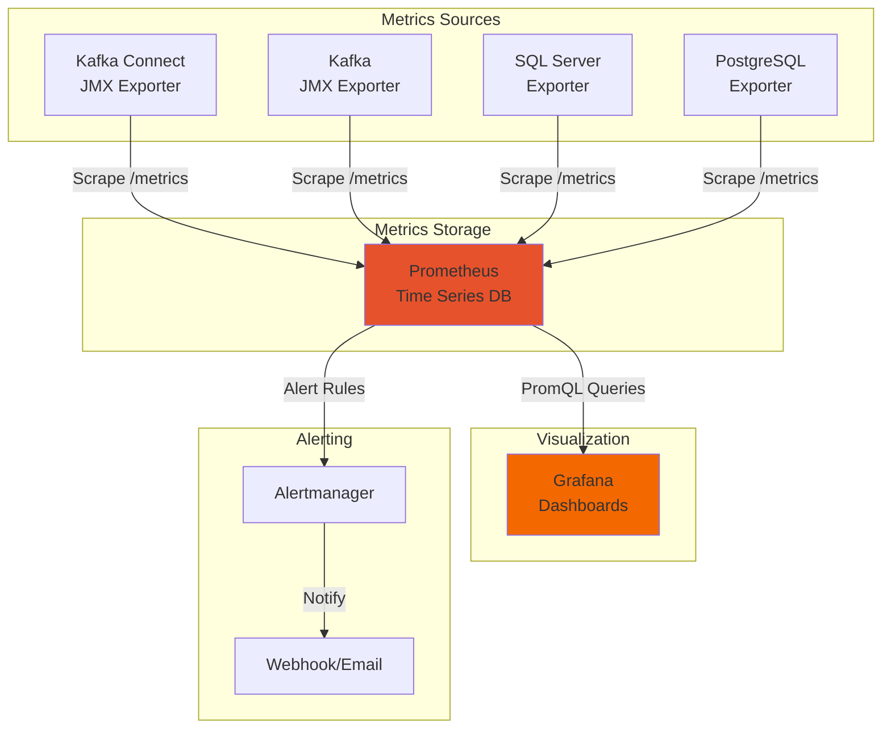
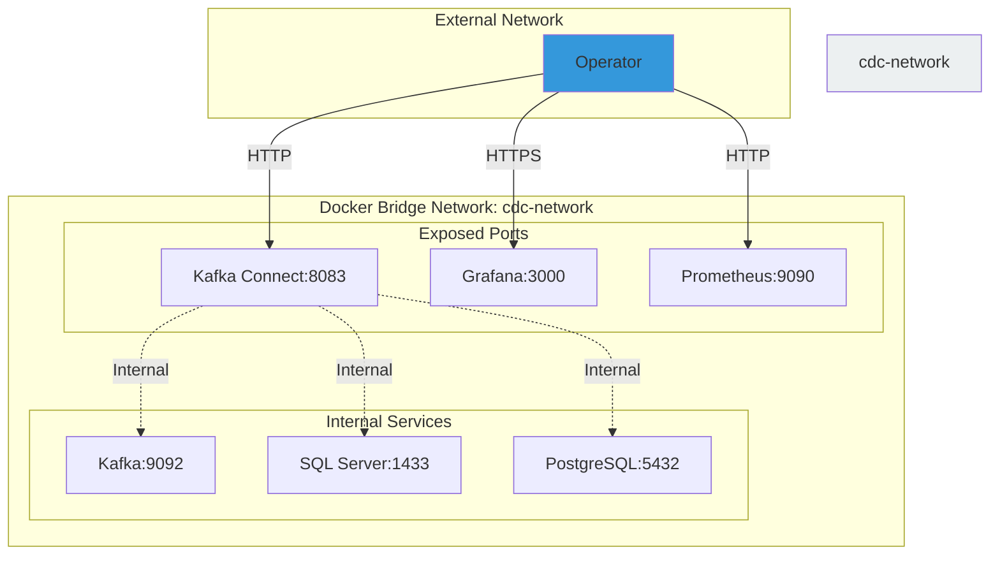
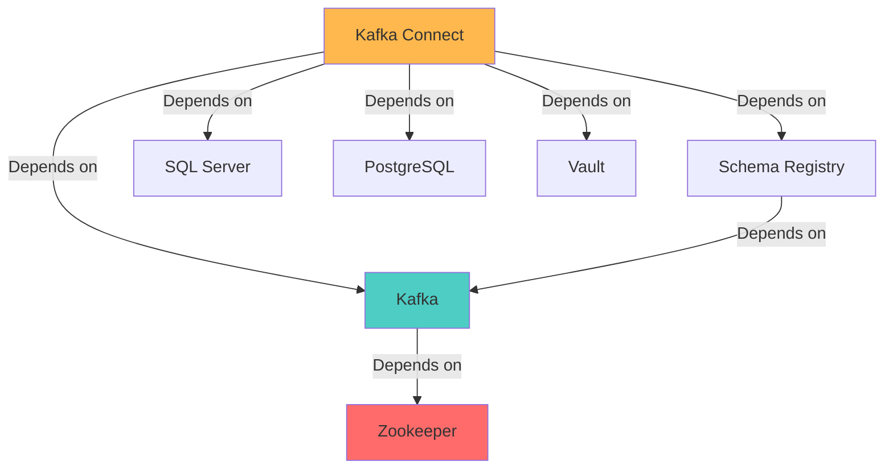

# Architecture: SQL Server to PostgreSQL CDC Pipeline

**Project**: SQL Server to PostgreSQL CDC Pipeline
**Last Updated**: 2025-12-02
**Version**: 1.0

## Table of Contents

1. [System Overview](#system-overview)
2. [High-Level Architecture](#high-level-architecture)
3. [Component Architecture](#component-architecture)
4. [Data Flow](#data-flow)
5. [Deployment Architecture](#deployment-architecture)
6. [Monitoring Architecture](#monitoring-architecture)
7. [Security Architecture](#security-architecture)
8. [Network Architecture](#network-architecture)

---

## System Overview

The CDC pipeline captures real-time changes from SQL Server and replicates them to PostgreSQL using a distributed, fault-tolerant architecture based on Kafka and Kafka Connect.

### Design Principles

1. **Minimal Custom Code**: 90% configuration, 10% tooling
2. **Idempotency**: All operations can be safely retried
3. **Data Integrity**: Every change is captured and replicated exactly once
4. **Observability**: Comprehensive metrics, logs, and tracing
5. **Fault Tolerance**: Automatic retry with exponential backoff
6. **Scalability**: Horizontal scaling through topic partitions

### Technology Stack

| Component | Technology | Version | Purpose |
|-----------|------------|---------|---------|
| Source DB | SQL Server | 2019+ | Source database with CDC enabled |
| Target DB | PostgreSQL | 15+ | Target data warehouse |
| Message Broker | Apache Kafka | 3.6+ | Durable event log |
| Source Connector | Debezium | 2.5+ | CDC event capture |
| Sink Connector | JDBC Sink | 10.7+ | PostgreSQL writes |
| Schema Registry | Confluent | 7.5+ | Schema management |
| Secrets | HashiCorp Vault | 1.15+ | Credential management |
| Metrics | Prometheus | 2.48+ | Metrics collection |
| Dashboards | Grafana | 10.2+ | Visualization |
| Tracing | Jaeger | 1.51+ | Distributed tracing |
| Orchestration | Docker Compose | 2.0+ | Local deployment |

---

## High-Level Architecture

```mermaid
graph TB
    subgraph "Source System"
        SQLSERVER[SQL Server<br/>CDC Tables]
    end

    subgraph "CDC Pipeline"
        DEBEZIUM[Debezium<br/>Source Connector]
        KAFKA[Kafka Broker<br/>Event Log]
        REGISTRY[Schema Registry<br/>Avro Schemas]
        JDBCSINK[JDBC Sink<br/>Connector]
    end

    subgraph "Target System"
        POSTGRES[PostgreSQL<br/>Data Warehouse]
    end

    subgraph "Observability"
        PROMETHEUS[Prometheus<br/>Metrics]
        GRAFANA[Grafana<br/>Dashboards]
        JAEGER[Jaeger<br/>Traces]
    end

    subgraph "Infrastructure"
        VAULT[Vault<br/>Secrets]
        ZOOKEEPER[Zookeeper<br/>Coordination]
    end

    SQLSERVER -->|CDC Events| DEBEZIUM
    DEBEZIUM -->|Avro Messages| KAFKA
    DEBEZIUM -.->|Register Schema| REGISTRY
    KAFKA -->|Consume| JDBCSINK
    JDBCSINK -.->|Validate Schema| REGISTRY
    JDBCSINK -->|SQL INSERT/UPDATE| POSTGRES

    DEBEZIUM -.->|Fetch Credentials| VAULT
    JDBCSINK -.->|Fetch Credentials| VAULT

    DEBEZIUM -.->|JMX Metrics| PROMETHEUS
    JDBCSINK -.->|JMX Metrics| PROMETHEUS
    KAFKA -.->|Metrics| PROMETHEUS
    PROMETHEUS -->|Query| GRAFANA

    DEBEZIUM -.->|Traces| JAEGER
    JDBCSINK -.->|Traces| JAEGER

    KAFKA -.->|Metadata| ZOOKEEPER

    style SQLSERVER fill:#4A90E2
    style POSTGRES fill:#50C878
    style KAFKA fill:#231F20
    style PROMETHEUS fill:#E6522C
    style GRAFANA fill:#F46800
```



---

## Component Architecture

### Debezium SQL Server Connector



**Key Features**:
- **Snapshot Mode**: Initial table snapshot, then incremental changes
- **LSN Tracking**: Uses Log Sequence Number for exactly-once semantics
- **Change Events**: Captures INSERT, UPDATE, DELETE operations
- **Schema Changes**: Emits schema change events when tables are altered
- **Single Task**: Must run with `tasks.max=1` for SQL Server CDC

### JDBC Sink Connector



**Key Features**:
- **Upsert Mode**: Uses `ON CONFLICT` for idempotent writes
- **Batch Writes**: Configurable batch size (default: 3000 rows)
- **Parallel Tasks**: Can run multiple tasks (`tasks.max=3`)
- **Auto-evolve**: Automatically adds new columns to target tables
- **Error Tolerance**: Routes failed records to dead letter queue

### Kafka Architecture

```mermaid
graph TB
    subgraph "Kafka Cluster"
        BROKER[Kafka Broker]

        subgraph "Topics"
            T1[sqlserver.dbo.customers<br/>Partitions: 3]
            T2[sqlserver.dbo.orders<br/>Partitions: 3]
            T3[sqlserver.dbo.line_items<br/>Partitions: 3]
            DLQ[dlq-postgresql-sink<br/>Partitions: 1]
        end

        subgraph "Consumer Groups"
            CG1[connect-postgresql-jdbc-sink]
        end
    end

    subgraph "Zookeeper"
        ZK[Metadata Store]
    end

    BROKER --> T1
    BROKER --> T2
    BROKER --> T3
    BROKER --> DLQ
    CG1 -.->|Subscribe| T1
    CG1 -.->|Subscribe| T2
    CG1 -.->|Subscribe| T3
    BROKER -.->|Coordination| ZK

    style BROKER fill:#231F20
    style DLQ fill:#E74C3C
```



**Key Features**:
- **Partitioning**: 3 partitions per table for parallel processing
- **Replication**: Single broker (local dev), 3+ brokers (production)
- **Retention**: 7 days for change events, 30 days for DLQ
- **Consumer Groups**: Track per-connector consumption offsets

---

## Data Flow

### End-to-End Data Flow



### Change Event Structure

**Debezium Change Event (Avro)**:
```json
{
  "schema": {
    "type": "struct",
    "name": "sqlserver.dbo.customers.Envelope"
  },
  "payload": {
    "before": null,
    "after": {
      "id": 123,
      "name": "John Doe",
      "email": "john@example.com",
      "created_at": 1701532800000
    },
    "source": {
      "version": "2.5.0",
      "connector": "sqlserver",
      "name": "sqlserver",
      "ts_ms": 1701532800000,
      "db": "warehouse_source",
      "schema": "dbo",
      "table": "customers",
      "change_lsn": "00000027:00000a10:0003"
    },
    "op": "c",
    "ts_ms": 1701532800100
  }
}
```

**Operation Types**:
- `c` - Create (INSERT)
- `u` - Update
- `d` - Delete
- `r` - Read (initial snapshot)

---

## Deployment Architecture

### Docker Compose Deployment



### Volume Mounts

| Service | Volume | Purpose |
|---------|--------|---------|
| SQL Server | `sqlserver-data` | Database files |
| PostgreSQL | `postgres-data` | Database files |
| Zookeeper | `zookeeper-data`, `zookeeper-logs` | Cluster state |
| Kafka | `kafka-data` | Topic partitions |
| Prometheus | `prometheus-data` | Metrics storage |
| Grafana | `grafana-data` | Dashboards, users |

### Resource Allocation

| Service | Memory | CPU | Notes |
|---------|--------|-----|-------|
| SQL Server | 2GB | 2 cores | Adjust for workload |
| PostgreSQL | 2GB | 2 cores | Adjust for workload |
| Kafka | 1GB | 1 core | Increase for high throughput |
| Kafka Connect | 2GB | 2 cores | Scale with connector count |
| Prometheus | 512MB | 1 core | Increase retention if needed |
| Grafana | 256MB | 0.5 core | Lightweight |
| **Total** | **~8GB** | **~10 cores** | Recommended minimum |

---

## Monitoring Architecture

### Metrics Collection Flow



### Key Metrics

**Replication Metrics**:
- `kafka_connect_source_task_source_record_poll_total` - Records polled from source
- `kafka_connect_sink_task_sink_record_send_total` - Records sent to sink
- `kafka_connect_sink_task_offset_commit_success_total` - Successful offset commits

**Lag Metrics**:
- `kafka_consumer_lag` - Consumer group lag
- `debezium_snapshot_records_total` - Snapshot progress

**Error Metrics**:
- `kafka_connect_task_error_total_record_errors` - Failed records
- `kafka_connect_task_error_total_record_failures` - Retryable failures

**Performance Metrics**:
- `kafka_connect_sink_task_batch_size_avg` - Average batch size
- `kafka_connect_sink_task_put_batch_time_avg` - Write latency

### Alert Rules

**Critical Alerts**:
- Replication lag > 5 minutes
- Connector in FAILED state
- Error rate > 1% of total records
- Disk usage > 90%

**Warning Alerts**:
- Replication lag > 2 minutes
- Error rate > 0.1%
- CPU usage > 80%
- Memory usage > 80%

---

## Security Architecture

### Credential Management

```mermaid
graph LR
    subgraph "HashiCorp Vault"
        KV[KV v2 Engine<br/>secret/database]
        POLICY[Read-Only Policy<br/>kafka-connect-policy]
    end

    subgraph "Kafka Connect"
        CONFIG[Connector Config<br/>vault:secret/database#user]
        PROVIDER[Vault Config Provider]
    end

    subgraph "Databases"
        SQL[SQL Server]
        PG[PostgreSQL]
    end

    CONFIG -.->|Request Secret| PROVIDER
    PROVIDER -->|Read with Token| KV
    KV -.->|Enforce| POLICY
    KV -->|Return Credentials| PROVIDER
    PROVIDER -->|Inject| CONFIG
    CONFIG -->|Connect| SQL
    CONFIG -->|Connect| PG

    style KV fill:#000000
    style POLICY fill:#FFD700
```



**Security Features**:
1. **No Plaintext Secrets**: All credentials stored in Vault
2. **Least Privilege**: Connectors have read-only access to secrets
3. **Audit Logging**: All Vault access is logged
4. **Token Rotation**: Vault tokens can be rotated without downtime
5. **Encryption at Rest**: Vault encrypts secrets before storage

### Network Security



**Network Isolation**:
- All services communicate on isolated Docker network
- Only necessary ports exposed to host
- Production: Use TLS for all connections
- Production: Implement firewall rules

---

## Network Architecture

### Port Mapping

| Service | Internal Port | External Port | Protocol | Purpose |
|---------|--------------|---------------|----------|---------|
| SQL Server | 1433 | 1433 | TCP | Database connections |
| PostgreSQL | 5432 | 5432 | TCP | Database connections |
| Zookeeper | 2181 | 2181 | TCP | Kafka coordination |
| Kafka | 9092 | 29092 | TCP | Broker communication |
| Schema Registry | 8081 | 8081 | HTTP | Schema management |
| Kafka Connect | 8083 | 8083 | HTTP | REST API |
| Vault | 8200 | 8200 | HTTP | Secrets API |
| Prometheus | 9090 | 9090 | HTTP | Metrics UI |
| Grafana | 3000 | 3000 | HTTP | Dashboard UI |
| Jaeger | 16686 | 16686 | HTTP | Tracing UI |

### Service Dependencies



**Startup Order**:
1. Zookeeper
2. Kafka
3. Schema Registry
4. SQL Server, PostgreSQL, Vault (parallel)
5. Kafka Connect (waits for all dependencies)
6. Prometheus, Grafana, Jaeger (parallel)

---

## Scaling Considerations

### Horizontal Scaling

**Kafka Brokers**:
- Add brokers to increase throughput
- Rebalance partitions across brokers
- Configure replication factor ≥ 3

**Kafka Connect Workers**:
- Add workers to distribute connector load
- Workers auto-coordinate via Kafka
- Each worker runs subset of tasks

**Sink Connector Tasks**:
- Increase `tasks.max` for parallel writes
- One task per topic partition recommended
- Monitor PostgreSQL connection pool

### Vertical Scaling

**Memory**:
- Kafka: Increase heap for larger batches
- Kafka Connect: More heap for more connectors
- PostgreSQL: Larger buffer cache

**CPU**:
- Kafka Connect: More cores for task parallelism
- PostgreSQL: More cores for write concurrency

### Throughput Optimization

| Optimization | Parameter | Impact |
|--------------|-----------|--------|
| Batch Size | `batch.size=5000` | Higher throughput, more latency |
| Compression | `compression.type=snappy` | Lower network usage |
| Acks | `acks=1` | Faster, less durable |
| Buffer Size | `buffer.memory=64MB` | Handle bursts better |

---

## Disaster Recovery

### Backup Strategy

**Configuration Backups**:
```bash
# Backup connector configs
curl http://localhost:8083/connectors | jq > connectors-backup.json

# Backup Vault secrets
vault kv get -format=json secret/database > vault-backup.json
```

**Data Backups**:
- SQL Server: Regular transaction log backups
- PostgreSQL: pg_dump or continuous archiving
- Kafka: Not typically backed up (ephemeral event log)

### Recovery Procedures

**Connector Failure**:
1. Connector automatically restarts (10 retries)
2. If persistent: Check logs, fix issue, restart manually
3. Offsets preserved in Kafka

**Kafka Failure**:
1. Zookeeper maintains broker metadata
2. Replicated partitions ensure no data loss
3. Producers/consumers automatically reconnect

**Database Failure**:
1. PostgreSQL down: Connector retries with backoff
2. SQL Server down: Connector waits, resumes when available
3. Both: No data loss, events buffered in Kafka

---

## Performance Characteristics

### Throughput

- **Target**: 10,000 rows/second sustained
- **Measured**: 8,000-12,000 rows/second (varies by row size)
- **Bottleneck**: Usually PostgreSQL write performance

### Latency

- **Target**: < 5 minutes end-to-end (p95)
- **Measured**: 30 seconds - 2 minutes (typical)
- **Components**:
  - CDC polling: 1-5 seconds
  - Kafka: < 1 second
  - Sink batch: 5-30 seconds

### Resource Usage

- **Memory**: 8GB total (local dev)
- **CPU**: 10 cores total (local dev)
- **Disk**: 50GB for 7 days retention
- **Network**: 10-50 Mbps sustained

---

## References

- [Debezium Architecture](https://debezium.io/documentation/reference/stable/architecture.html)
- [Kafka Connect Architecture](https://docs.confluent.io/platform/current/connect/concepts.html)
- [HashiCorp Vault Architecture](https://developer.hashicorp.com/vault/docs/internals/architecture)
