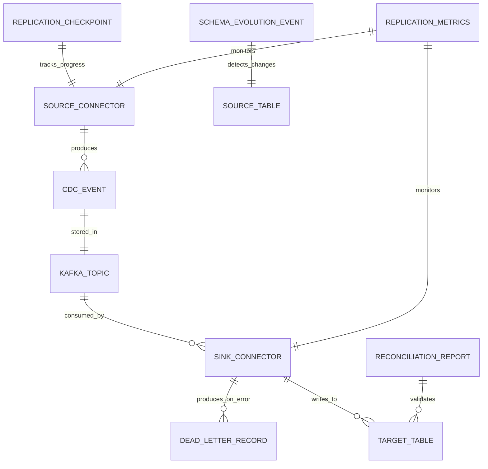
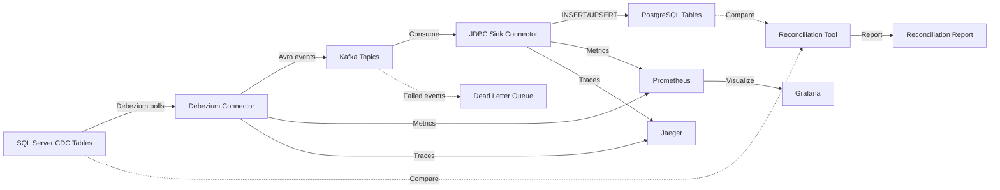

# Data Model: SQL Server to PostgreSQL CDC Pipeline

**Feature**: SQL Server to PostgreSQL CDC Pipeline
**Branch**: 001-sqlserver-pg-cdc
**Date**: 2025-12-02

## Overview

This document defines the data entities, schemas, and relationships within the CDC pipeline system. Note that the pipeline is primarily configuration-driven - the "data model" consists of:

1. **Configuration entities**: Connector configurations, topic mappings, schema registrations
2. **Operational entities**: Checkpoint state, reconciliation reports, dead letter records
3. **Metadata entities**: Schema evolution tracking, replication metrics

The actual business data (customers, orders, etc.) is defined by the source SQL Server tables and replicated as-is to PostgreSQL.

## Configuration Entities

### 1. Source Connector Configuration

**Purpose**: Defines how Debezium connects to SQL Server and which tables to capture

**Schema** (JSON):
```json
{
  "name": "string (unique connector name)",
  "config": {
    "connector.class": "io.debezium.connector.sqlserver.SqlServerConnector",
    "database.hostname": "string (Vault reference)",
    "database.port": "integer (default 1433)",
    "database.user": "string (Vault reference)",
    "database.password": "string (Vault reference)",
    "database.names": "string (comma-separated database names)",
    "table.include.list": "string (comma-separated schema.table patterns)",
    "snapshot.mode": "enum (initial, schema_only, no_snapshot)",
    "snapshot.isolation.mode": "enum (snapshot, repeatable_read)",
    "decimal.handling.mode": "enum (precise, double, string)",
    "time.precision.mode": "enum (adaptive, connect)",
    "tombstones.on.delete": "boolean",
    "max.batch.size": "integer (default 2048)",
    "max.queue.size": "integer (default 8192)",
    "poll.interval.ms": "integer (default 500)"
  }
}
```

**Validation Rules**:
- `name` must be unique across all connectors
- `database.names` must reference CDC-enabled databases
- `table.include.list` must use `schema.table` format
- `max.queue.size` should be 4x `max.batch.size`

**State Transitions**:
```
UNASSIGNED → RUNNING → PAUSED → RUNNING
         ↓                    ↓
      FAILED               FAILED
```

**Storage**: Kafka Connect distributed config topic `connect-configs`

### 2. Sink Connector Configuration

**Purpose**: Defines how JDBC Sink writes to PostgreSQL

**Schema** (JSON):
```json
{
  "name": "string (unique connector name)",
  "config": {
    "connector.class": "io.confluent.connect.jdbc.JdbcSinkConnector",
    "connection.url": "string (JDBC URL with Vault references)",
    "connection.user": "string (Vault reference)",
    "connection.password": "string (Vault reference)",
    "topics": "string (comma-separated topic names)",
    "insert.mode": "enum (insert, upsert, update)",
    "pk.mode": "enum (none, kafka, record_key, record_value)",
    "pk.fields": "string (comma-separated primary key columns)",
    "table.name.format": "string (template using ${topic})",
    "auto.create": "boolean (default false)",
    "auto.evolve": "boolean (default true)",
    "batch.size": "integer (default 3000)",
    "connection.pool.size": "integer (default 10)",
    "errors.tolerance": "enum (none, all)",
    "errors.deadletterqueue.topic.name": "string (DLQ topic name)"
  }
}
```

**Validation Rules**:
- `insert.mode=upsert` requires `pk.mode=record_value` and `pk.fields`
- `topics` must match Debezium source topics
- `errors.deadletterqueue.topic.name` must exist if `errors.tolerance=all`

**Storage**: Kafka Connect distributed config topic `connect-configs`

### 3. Topic Configuration

**Purpose**: Defines Kafka topics for CDC events

**Schema** (YAML for documentation, configured via Kafka Admin API):
```yaml
topics:
  - name: "sqlserver.{database}.{schema}.{table}"
    partitions: 3
    replication_factor: 3  # production: 3, local: 1
    config:
      retention.ms: 604800000  # 7 days
      compression.type: "lz4"
      min.insync.replicas: 2   # production: 2, local: 1
      cleanup.policy: "delete"

  - name: "dlq-postgresql-sink"
    partitions: 1
    replication_factor: 3
    config:
      retention.ms: 2592000000  # 30 days (longer for DLQ)
      compression.type: "lz4"
```

**Naming Convention**:
- CDC topics: `{source}.{database}.{schema}.{table}`
- Dead letter queue: `dlq-{connector-name}`
- Internal topics: `connect-{configs,offsets,status}`

**Storage**: Kafka topic metadata (Zookeeper or KRaft)

## Operational Entities

### 4. Replication Checkpoint

**Purpose**: Tracks CDC pipeline progress per source table

**Schema**: Stored in Kafka Connect offsets topic (opaque format), queried via REST API

**Logical Schema** (for reconciliation tool):
```python
{
  "source_table": "string (schema.table)",
  "connector_name": "string",
  "last_lsn": "string (SQL Server LSN in hex)",
  "last_event_timestamp": "datetime (UTC)",
  "last_offset_commit": "datetime (UTC)",
  "total_events_processed": "integer"
}
```

**Query Method**:
```bash
curl http://localhost:8083/connectors/sqlserver-cdc-source/status
```

**State Transitions**:
```
NULL (new table) → SNAPSHOT_START → SNAPSHOT_COMPLETE → STREAMING
```

### 5. Reconciliation Report

**Purpose**: Output of comparing SQL Server source vs PostgreSQL target

**Schema** (JSON):
```json
{
  "report_id": "string (UUID)",
  "generated_at": "datetime (ISO 8601 UTC)",
  "source_database": "string",
  "target_database": "string",
  "tables": [
    {
      "source_table": "string (schema.table)",
      "target_table": "string",
      "source_row_count": "integer",
      "target_row_count": "integer",
      "row_count_match": "boolean",
      "source_checksum": "string (MD5 hex)",
      "target_checksum": "string (MD5 hex)",
      "checksum_match": "boolean",
      "discrepancies": [
        {
          "primary_key": "object (key-value pairs)",
          "mismatch_type": "enum (missing_in_target, missing_in_source, value_mismatch)",
          "source_values": "object (nullable)",
          "target_values": "object (nullable)"
        }
      ],
      "status": "enum (ok, row_count_mismatch, checksum_mismatch, critical)",
      "recommended_action": "string"
    }
  ],
  "summary": {
    "total_tables": "integer",
    "tables_ok": "integer",
    "tables_with_discrepancies": "integer",
    "total_discrepancies": "integer"
  }
}
```

**Validation Rules**:
- `generated_at` must be within last 24 hours for reports to be considered fresh
- `discrepancies` array empty if `status=ok`
- `recommended_action` must provide actionable guidance

**Storage**: File system (`/var/reports/reconciliation-{report_id}.json`)

**State Machine** (reconciliation run):
```
QUEUED → RUNNING → COMPLETED
    ↓               ↓
  FAILED         FAILED
```

### 6. Dead Letter Record

**Purpose**: Stores CDC events that failed to process

**Schema** (Avro in DLQ topic):
```json
{
  "type": "record",
  "name": "DeadLetterRecord",
  "fields": [
    {"name": "original_topic", "type": "string"},
    {"name": "original_partition", "type": "int"},
    {"name": "original_offset", "type": "long"},
    {"name": "original_key", "type": ["null", "bytes"]},
    {"name": "original_value", "type": ["null", "bytes"]},
    {"name": "error_timestamp", "type": "long", "logicalType": "timestamp-millis"},
    {"name": "error_class", "type": "string"},
    {"name": "error_message", "type": "string"},
    {"name": "error_stack_trace", "type": "string"},
    {"name": "retry_count", "type": "int", "default": 0},
    {"name": "resolution_status", "type": {
      "type": "enum",
      "name": "ResolutionStatus",
      "symbols": ["PENDING", "RESOLVED", "IGNORED"]
    }, "default": "PENDING"}
  ]
}
```

**Validation Rules**:
- `original_topic` must match CDC topic naming pattern
- `error_message` should be human-readable
- `retry_count` incremented on each retry attempt

**State Transitions**:
```
PENDING → RESOLVED (manual fix)
    ↓
  IGNORED (skip event)
```

**Storage**: Kafka topic `dlq-postgresql-sink` (30-day retention)

## Metadata Entities

### 7. Schema Evolution Event

**Purpose**: Tracks detected schema changes in source tables

**Schema** (JSON log entry):
```json
{
  "event_id": "string (UUID)",
  "detected_at": "datetime (ISO 8601 UTC)",
  "source_table": "string (schema.table)",
  "change_type": "enum (ADD_COLUMN, DROP_COLUMN, MODIFY_COLUMN, RENAME_COLUMN)",
  "change_details": {
    "column_name": "string",
    "old_type": "string (nullable for ADD)",
    "new_type": "string (nullable for DROP)",
    "nullable": "boolean",
    "default_value": "string (nullable)"
  },
  "handling_status": "enum (AUTO_APPLIED, PENDING_REVIEW, FAILED, MANUAL_REQUIRED)",
  "connector_action": "enum (CONTINUED, PAUSED, ERRORED)",
  "alert_sent": "boolean"
}
```

**Storage**: Structured log file (`/var/log/schema-evolution.jsonl`) and Prometheus metric

**State Transitions**:
```
DETECTED → AUTO_APPLIED → VERIFIED
    ↓
  PENDING_REVIEW → MANUAL_REQUIRED → RESOLVED
```

### 8. Replication Metrics

**Purpose**: Time-series metrics for monitoring

**Schema** (Prometheus time-series):
```prometheus
# Replication lag (seconds)
cdc_replication_lag_seconds{connector="sqlserver-cdc-source", table="dbo.customers"} 3.5

# Throughput (records per second)
cdc_throughput_records_per_second{connector="sqlserver-cdc-source", direction="source"} 1250.0
cdc_throughput_records_per_second{connector="postgresql-jdbc-sink", direction="sink"} 1200.0

# Error rate (errors per minute)
cdc_error_rate{connector="postgresql-jdbc-sink", type="transformation"} 0.5

# Dead letter queue size
kafka_topic_partition_current_offset{topic="dlq-postgresql-sink", partition="0"} 42

# Connector task status
kafka_connect_connector_task_status{connector="sqlserver-cdc-source", task="0", status="RUNNING"} 1

# Resource usage
process_cpu_usage{connector="kafka-connect-worker-1"} 0.45
jvm_memory_used_bytes{connector="kafka-connect-worker-1", area="heap"} 2147483648
```

**Storage**: Prometheus time-series database (15-day retention by default)

## Entity Relationships



## SQL Server CDC Tables (Source Metadata)

**Purpose**: SQL Server's built-in CDC system tables that Debezium reads

**Key Tables**:
```sql
-- CDC capture instances (one per tracked table)
cdc.dbo_customers_CT  -- Change table for dbo.customers
  __$start_lsn BINARY(10)     -- Log Sequence Number
  __$end_lsn BINARY(10)
  __$seqval BINARY(10)
  __$operation INT            -- 1=DELETE, 2=INSERT, 3=UPDATE_BEFORE, 4=UPDATE_AFTER
  __$update_mask VARBINARY    -- Bitmask of changed columns
  [original table columns]

-- CDC configuration
cdc.change_tables
  source_object_id INT
  capture_instance NVARCHAR(100)
  start_lsn BINARY(10)

-- Current LSN tracking
cdc.lsn_time_mapping
  start_lsn BINARY(10)
  tran_begin_time DATETIME
  tran_end_time DATETIME
```

**Debezium Query Pattern**:
```sql
-- Debezium polls this query
SELECT * FROM cdc.dbo_customers_CT
WHERE __$start_lsn > ? AND __$start_lsn <= ?
ORDER BY __$start_lsn, __$seqval
```

## PostgreSQL Target Tables

**Purpose**: Replicated tables in PostgreSQL data warehouse

**Schema**: Matches source SQL Server tables with PostgreSQL type mappings

**Example**:
```sql
-- Source: SQL Server dbo.customers
CREATE TABLE customers (
  id BIGINT PRIMARY KEY,
  name VARCHAR(255) NOT NULL,
  email VARCHAR(255),
  created_at TIMESTAMP,
  updated_at TIMESTAMP,
  is_active BOOLEAN DEFAULT TRUE
);

-- Indexes for query performance
CREATE INDEX idx_customers_email ON customers(email);
CREATE INDEX idx_customers_created_at ON customers(created_at);

-- Constraint for data quality
ALTER TABLE customers ADD CONSTRAINT unique_email UNIQUE (email);
```

**Additional Metadata Columns** (optional, configured via SMT):
```sql
-- Debezium metadata enrichment
ALTER TABLE customers ADD COLUMN __source_lsn VARCHAR(50);
ALTER TABLE customers ADD COLUMN __source_timestamp TIMESTAMPTZ;
ALTER TABLE customers ADD COLUMN __operation VARCHAR(10);  -- INSERT/UPDATE/DELETE
```

## Vault Secrets Schema

**Purpose**: Credential storage in HashiCorp Vault

**Path Structure**:
```
secret/
├── db/
│   ├── sqlserver_host      = "sqlserver.example.com"
│   ├── sqlserver_port      = "1433"
│   ├── sqlserver_user      = "cdc_reader"
│   ├── sqlserver_password  = "<generated>"
│   ├── postgres_host       = "postgres.example.com"
│   ├── postgres_port       = "5432"
│   ├── postgres_user       = "cdc_writer"
│   └── postgres_password   = "<generated>"
└── kafka/
    ├── connect_user        = "kafka-connect"
    └── connect_password    = "<generated>"
```

**Access Policy**:
```hcl
path "secret/db/*" {
  capabilities = ["read"]
}

path "secret/kafka/*" {
  capabilities = ["read"]
}
```

## Data Flow



## Validation Rules Summary

### Pre-Replication Validation
1. SQL Server tables must have primary keys defined
2. SQL Server CDC must be enabled at database and table level
3. PostgreSQL tables must exist (if `auto.create=false`) with matching primary keys
4. Debezium connector config must reference valid Vault secrets

### In-Flight Validation
1. Avro schema must be registered in Schema Registry before events published
2. Events must conform to registered schema (enforced by producer)
3. Primary key fields must be non-null in CDC events

### Post-Replication Validation
1. Row counts should match (within replication lag window)
2. Checksums should match (within reconciliation tolerance)
3. Dead letter queue should be empty or below threshold (< 0.1% error rate)

## Summary

The data model for the CDC pipeline is primarily **configuration-driven** with minimal custom schemas:

- **Configuration entities** define connectors and topics (JSON/YAML)
- **Operational entities** track state and errors (Kafka Connect internal + custom reconciliation)
- **Metadata entities** provide observability (Prometheus metrics, logs)
- **Business data** is replicated as-is from SQL Server to PostgreSQL with type mapping

All entities follow the constitution's principles: simple, testable, and with clear validation rules. The model supports the required features: replication, monitoring, reconciliation, schema evolution, and error handling.
