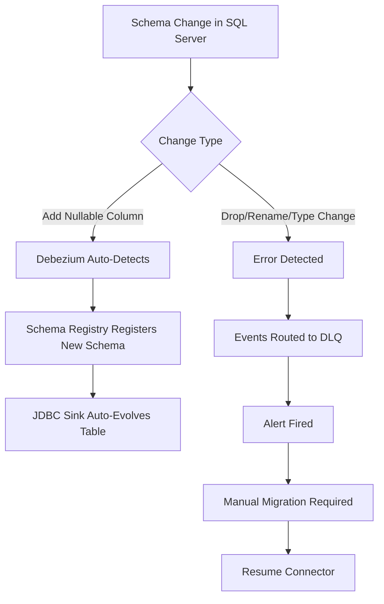

# Research: SQL Server to PostgreSQL CDC Pipeline

**Feature**: SQL Server to PostgreSQL CDC Pipeline
**Branch**: 001-sqlserver-pg-cdc
**Date**: 2025-12-02

## Overview

This document captures technical research and design decisions for implementing a production-grade CDC pipeline from SQL Server to PostgreSQL. All decisions prioritize open-source components, minimal custom code, and operational simplicity.

## Technology Stack Decisions

### Decision 1: Debezium SQL Server CDC Connector

**Decision**: Use Debezium 2.5+ SQL Server CDC Source Connector from Confluent Hub

**Rationale**:
- **Mature and battle-tested**: Debezium is the de facto standard for CDC in open-source ecosystems, used by Netflix, Uber, Zalando
- **Native SQL Server CDC support**: Leverages SQL Server's built-in Change Data Capture feature, avoiding custom triggers or polling
- **LSN-based tracking**: Uses Log Sequence Numbers for exactly-once semantics and checkpoint resumability
- **Schema evolution support**: Automatically detects schema changes and can update Kafka topics accordingly
- **Avro schema integration**: Works seamlessly with Confluent Schema Registry for strong typing and schema evolution

**Alternatives Considered**:
- **Custom polling solution**: Rejected - requires significant custom code, no transactional guarantees, violates "minimal custom code" principle
- **AWS DMS or Azure Data Migration Service**: Rejected - cloud-specific, not open-source, expensive
- **Maxwell's Daemon**: Rejected - MySQL-focused, limited SQL Server support
- **StreamSets**: Rejected - enterprise features require paid license

**Best Practices**:
- Enable SQL Server CDC at database level before deploying connector
- Use `snapshot.mode=initial` for initial data load, then switch to `schema_only` for subsequent runs
- Configure `max.batch.size` and `max.queue.size` based on transaction volume (start with 2048/8192)
- Set `poll.interval.ms=500` for sub-second latency
- Use `tombstones.on.delete=true` to emit delete markers for proper cleanup

**Configuration Example**:
```json
{
  "name": "sqlserver-cdc-source",
  "config": {
    "connector.class": "io.debezium.connector.sqlserver.SqlServerConnector",
    "database.hostname": "${vault:secret/db#sqlserver_host}",
    "database.port": "1433",
    "database.user": "${vault:secret/db#sqlserver_user}",
    "database.password": "${vault:secret/db#sqlserver_password}",
    "database.names": "warehouse_source",
    "table.include.list": "dbo.customers,dbo.orders,dbo.line_items",
    "snapshot.mode": "initial",
    "snapshot.isolation.mode": "snapshot",
    "decimal.handling.mode": "precise",
    "time.precision.mode": "adaptive",
    "tombstones.on.delete": true
  }
}
```

### Decision 2: Confluent JDBC Sink Connector for PostgreSQL

**Decision**: Use Confluent JDBC Sink Connector (latest stable from Confluent Hub)

**Rationale**:
- **Upsert support**: `insert.mode=upsert` with `pk.mode=record_value` for idempotent writes
- **Automatic table creation**: Can create PostgreSQL tables from Avro schemas (useful for initial setup)
- **Batch writes**: Configurable `batch.size` for throughput optimization
- **Error handling**: Built-in dead letter queue support via `errors.tolerance=all` and `errors.deadletterqueue.topic.name`
- **Community support**: Widely deployed, extensive documentation

**Alternatives Considered**:
- **Custom Python consumer**: Rejected - significant custom code, requires error handling, retry logic, connection pooling
- **Debezium JDBC sink**: Similar features but less mature than Confluent's implementation
- **PGSync or Airbyte**: Rejected - adds another orchestration layer, not pure Kafka Connect

**Best Practices**:
- Use `insert.mode=upsert` with `pk.fields` matching source table primary keys
- Set `auto.create=false` and `auto.evolve=true` for production (manually create tables with proper indexes/constraints)
- Configure `batch.size=3000` and `connection.attempts=10` for resilience
- Enable `errors.deadletterqueue` for non-retriable errors (schema mismatch, constraint violations)
- Use connection pooling: `connection.pool.size=10`

**Configuration Example**:
```json
{
  "name": "postgresql-jdbc-sink",
  "config": {
    "connector.class": "io.confluent.connect.jdbc.JdbcSinkConnector",
    "connection.url": "jdbc:postgresql://${vault:secret/db#postgres_host}:5432/warehouse_target",
    "connection.user": "${vault:secret/db#postgres_user}",
    "connection.password": "${vault:secret/db#postgres_password}",
    "topics": "sqlserver.dbo.customers,sqlserver.dbo.orders",
    "insert.mode": "upsert",
    "pk.mode": "record_value",
    "pk.fields": "id",
    "table.name.format": "${topic}",
    "auto.create": "false",
    "auto.evolve": "true",
    "batch.size": 3000,
    "errors.tolerance": "all",
    "errors.deadletterqueue.topic.name": "dlq-postgresql-sink"
  }
}
```

### Decision 3: Apache Kafka + Confluent Schema Registry

**Decision**: Use Apache Kafka 3.6+ and Confluent Schema Registry 7.5+ (open-source versions)

**Rationale**:
- **Durability**: Kafka provides durable, replicated event log with configurable retention
- **Ordering guarantees**: Per-partition ordering ensures event sequence consistency
- **Scalability**: Horizontal scaling via topic partitions (partition by table or primary key)
- **Schema evolution**: Schema Registry enforces Avro schema compatibility, preventing breaking changes
- **Decoupling**: Producers and consumers evolve independently

**Alternatives Considered**:
- **RabbitMQ or ActiveMQ**: Rejected - not designed for high-throughput streaming, lacks built-in schema management
- **Pulsar**: Considered - good features but smaller community, less mature connector ecosystem
- **AWS Kinesis or Azure Event Hubs**: Rejected - cloud-specific, not on-premises friendly

**Best Practices for Kafka**:
- Use 3 brokers minimum for production (1 for local dev)
- Replication factor: 3 (production), 1 (local)
- Retention: `log.retention.hours=168` (7 days) or `log.retention.bytes=100GB` per partition
- Compression: `compression.type=lz4` for balance of speed and size
- Topic naming: `{source}.{schema}.{table}` (e.g., `sqlserver.dbo.customers`)

**Best Practices for Schema Registry**:
- Compatibility mode: `FORWARD_TRANSITIVE` (allows adding optional fields)
- Enable schema validation in Debezium: `key.converter=io.confluent.connect.avro.AvroConverter`
- Version all schemas and document breaking changes

**Docker Compose Services**:
- Zookeeper: Required for Kafka 3.6 (or use KRaft mode in Kafka 3.7+)
- Kafka broker(s)
- Schema Registry
- Kafka Connect workers (separate service from brokers)

### Decision 4: HashiCorp Vault for Secrets Management

**Decision**: Use HashiCorp Vault 1.15+ (open-source) for all credential storage

**Rationale**:
- **Centralized secrets**: Single source of truth for SQL Server, PostgreSQL, Kafka credentials
- **Dynamic secrets**: Can rotate credentials without redeploying connectors
- **Audit trail**: All secret access logged
- **Integration**: Kafka Connect has native Vault integration via ConfigProvider

**Alternatives Considered**:
- **Environment variables**: Rejected - no rotation support, secrets visible in process list
- **Kubernetes Secrets**: Rejected - only works in K8s, not Docker Compose friendly
- **AWS Secrets Manager / Azure Key Vault**: Rejected - cloud-specific

**Best Practices**:
- Use KV v2 secrets engine for versioned secrets
- Path structure: `secret/db/{sqlserver,postgres}_{host,user,password}`
- Enable audit logging: `vault audit enable file file_path=/vault/logs/audit.log`
- Use policies to restrict connector access to only required secrets
- Initialize Vault with `vault-init.sh` script on first run

**Integration with Kafka Connect**:
```properties
# In Kafka Connect worker config
config.providers=vault
config.providers.vault.class=io.github.jcustenborder.kafka.config.vault.VaultConfigProvider
config.providers.vault.param.vault.address=http://vault:8200
config.providers.vault.param.vault.token=${VAULT_TOKEN}
```

**Connector Config Referencing Vault**:
```json
{
  "database.hostname": "${vault:secret/db#sqlserver_host}",
  "database.user": "${vault:secret/db#sqlserver_user}",
  "database.password": "${vault:secret/db#sqlserver_password}"
}
```

### Decision 5: Prometheus + Grafana + Jaeger for Observability

**Decision**: Use Prometheus 2.48+, Grafana 10.2+, Jaeger 1.51+ for comprehensive observability

**Rationale**:
- **Prometheus**: Industry-standard metrics collection with powerful query language (PromQL)
- **Grafana**: Flexible dashboards with alerting, supports multiple data sources
- **Jaeger**: OpenTelemetry-compatible distributed tracing for event lineage

**Monitoring Stack Architecture**:
1. **Kafka Connect JMX Exporter** → Prometheus (connector metrics: tasks, offsets, lag, throughput)
2. **SQL Server Exporter** → Prometheus (CDC table metrics, LSN position)
3. **PostgreSQL Exporter** → Prometheus (connection pool, query performance)
4. **Kafka Exporter** → Prometheus (topic lag, partition metrics)
5. **Jaeger Agent** ← Kafka Connect (distributed traces with Zipkin-compatible headers)

**Key Metrics to Monitor**:
- **Replication lag**: Time difference between SQL Server LSN and Kafka Connect offset
- **Throughput**: Records processed per second (source and sink)
- **Error rate**: Failed tasks, dead letter queue size
- **Resource usage**: CPU, memory, disk I/O per connector
- **Kafka lag**: Consumer group lag per topic partition

**Grafana Dashboards**:
- CDC Pipeline Overview: End-to-end lag, throughput, error rate
- Kafka Connect: Task status, connector health, offset commits
- Kafka Cluster: Broker metrics, topic sizes, replication status
- Database Health: SQL Server CDC capture lag, PostgreSQL connection pool

**Alerting Rules** (Prometheus Alertmanager):
```yaml
groups:
  - name: cdc_pipeline
    rules:
      - alert: HighReplicationLag
        expr: cdc_replication_lag_seconds > 600  # 10 minutes
        for: 5m
        annotations:
          summary: "Replication lag exceeds 10 minutes"

      - alert: ConnectorTaskFailed
        expr: kafka_connect_connector_task_status{status="FAILED"} > 0
        for: 1m
        annotations:
          summary: "Kafka Connect task failed: {{ $labels.connector }}"

      - alert: DeadLetterQueueGrowth
        expr: rate(kafka_topic_partition_current_offset{topic="dlq-postgresql-sink"}[5m]) > 10
        for: 5m
        annotations:
          summary: "Dead letter queue growing rapidly"
```

### Decision 6: Python for Reconciliation Tool

**Decision**: Build reconciliation tool in Python 3.11 with pytest, SQLAlchemy, psycopg2, pyodbc

**Rationale**:
- **Rich ecosystem**: SQLAlchemy for database abstraction, pandas for data comparison
- **Testability**: pytest with fixtures for TDD workflow
- **Scripting friendly**: Easy CLI with argparse or Click
- **Database support**: Native connectors for both SQL Server (pyodbc) and PostgreSQL (psycopg2)

**Reconciliation Algorithm**:
1. **Row count comparison**: Fast first-pass check
2. **Checksum validation**: Compare aggregated checksums per table (MD5 or CRC32 of all columns)
3. **Row-level diff**: If checksums mismatch, identify specific rows (compare by primary key)
4. **Report generation**: Output discrepancies to JSON/CSV with remediation suggestions

**CLI Interface**:
```bash
# On-demand reconciliation
python scripts/python/reconcile.py \
  --source-table dbo.customers \
  --target-table customers \
  --report-format json \
  --output /tmp/reconcile-report.json

# Scheduled reconciliation (via cron or APScheduler)
python scripts/python/reconcile.py \
  --schedule "0 2 * * *"  # Daily at 2 AM \
  --all-tables \
  --alert-on-mismatch
```

**Scheduler Options**:
- **APScheduler**: Lightweight Python library for cron-like scheduling (recommended for simple use cases)
- **System cron**: Traditional cron job calling reconcile script
- **Airflow/Prefect**: Rejected for MVP - adds orchestration complexity, but could be future enhancement

### Decision 7: Docker Compose for Local Development

**Decision**: Use Docker Compose v2+ with profiles for different environments (dev, test, prod)

**Services**:
- `sqlserver`: Microsoft SQL Server 2019 with CDC enabled
- `postgres`: PostgreSQL 15
- `zookeeper`: Kafka coordination
- `kafka`: Single broker for local (3+ for prod)
- `schema-registry`: Confluent Schema Registry
- `kafka-connect`: Kafka Connect workers with Debezium and JDBC connectors pre-installed
- `vault`: HashiCorp Vault (dev mode for local, production mode for staging/prod)
- `prometheus`: Metrics collection
- `grafana`: Dashboards and alerting
- `jaeger`: Distributed tracing

**Compose Profiles**:
```yaml
services:
  # Core services (always running)
  sqlserver:
    profiles: ["dev", "test", "prod"]

  # Monitoring services (optional for tests)
  prometheus:
    profiles: ["dev", "prod"]

  # Test-specific overrides
  testcontainers:
    profiles: ["test"]
```

**Usage**:
```bash
# Full stack for development
docker-compose --profile dev up -d

# Minimal stack for integration tests
docker-compose --profile test up -d

# Production-like environment
docker-compose --profile prod up -d
```

### Decision 8: Bash/Python Scripts for Management (No API)

**Decision**: Provide operational tooling via Bash and Python scripts, no centralized management API

**Rationale**:
- **Simplicity**: No additional service to maintain, deploy, secure
- **Transparency**: Scripts are readable, auditable, and version-controlled
- **Flexibility**: Developers can customize scripts or call Kafka Connect REST API directly
- **CI/CD friendly**: Scripts integrate naturally with GitOps workflows

**Script Categories**:

1. **Deployment** (`scripts/bash/deploy-connector.sh`):
   - Validates connector configuration JSON
   - Deploys to Kafka Connect via REST API
   - Waits for connector to reach RUNNING state

2. **Scaling** (`scripts/bash/scale-connector.sh`):
   - Adjusts `tasks.max` parameter
   - Useful for handling increased load or partitioned tables

3. **Operations** (`scripts/bash/pause-resume.sh`):
   - Pauses/resumes connectors (e.g., during maintenance windows)
   - Validates state transitions

4. **Monitoring** (`scripts/bash/monitor.sh`):
   - Queries Kafka Connect API for connector/task status
   - Queries Prometheus for key metrics
   - Outputs human-readable summary or JSON for automation

5. **Vault Initialization** (`scripts/bash/vault-init.sh`):
   - Initializes Vault with database credentials
   - Creates policies for Kafka Connect access
   - Outputs root token and unseal keys securely

**Example Script Interface**:
```bash
# Deploy connector
./scripts/bash/deploy-connector.sh \
  --config docker/configs/debezium/sqlserver-source.json \
  --connect-url http://localhost:8083

# Scale connector to 4 tasks
./scripts/bash/scale-connector.sh \
  --connector sqlserver-cdc-source \
  --tasks 4

# Monitor pipeline health
./scripts/bash/monitor.sh --format json

# Trigger on-demand reconciliation
python scripts/python/reconcile.py --table customers --report

# Schedule reconciliation (daily at 2 AM)
python scripts/python/reconcile.py --schedule "0 2 * * *" --all-tables
```

## Data Type Mappings

### SQL Server → Kafka (Avro) → PostgreSQL

| SQL Server Type | Avro Type | PostgreSQL Type | Notes |
|----------------|-----------|-----------------|-------|
| INT, SMALLINT, TINYINT | int | INTEGER, SMALLINT | Direct mapping |
| BIGINT | long | BIGINT | Direct mapping |
| DECIMAL, NUMERIC | bytes (decimal logical type) | NUMERIC | Precision preserved |
| FLOAT, REAL | double | DOUBLE PRECISION | Precision loss possible |
| CHAR, VARCHAR, TEXT | string | VARCHAR, TEXT | UTF-8 encoding |
| NCHAR, NVARCHAR | string | VARCHAR, TEXT | Unicode preserved |
| DATE | int (date logical type) | DATE | Days since epoch |
| TIME | long (time-micros) | TIME | Microsecond precision |
| DATETIME, DATETIME2 | long (timestamp-micros) | TIMESTAMP | Microsecond precision |
| DATETIMEOFFSET | string | TIMESTAMPTZ | ISO 8601 format |
| BIT | boolean | BOOLEAN | Direct mapping |
| BINARY, VARBINARY | bytes | BYTEA | Direct mapping |
| UNIQUEIDENTIFIER | string | UUID | String representation of GUID |
| XML | string | TEXT or XML | Requires SMT for parsing |
| GEOGRAPHY, GEOMETRY | string (WKT) | GEOGRAPHY, GEOMETRY | Requires PostGIS |

**Special Handling**:
- **NULLs**: Preserved across all types
- **Decimals**: Use Debezium `decimal.handling.mode=precise` to avoid precision loss
- **Timestamps**: Use `time.precision.mode=adaptive` for microsecond precision
- **UUIDs**: SQL Server GUIDs converted to lowercase UUID strings

## Schema Evolution Strategies

### Supported Changes (Automatic)
1. **Add nullable column**: Debezium detects new column, Schema Registry registers new schema version, JDBC sink adds column to PostgreSQL
2. **Add column with default**: Requires manual PostgreSQL ALTER TABLE before Debezium starts sending new schema

### Requires Manual Intervention
1. **Drop column**: Dead letter queue captures errors, manual ALTER TABLE needed
2. **Rename column**: Appears as drop + add, requires data migration
3. **Change data type (incompatible)**: Pause connector, migrate data, update schema, resume
4. **Add NOT NULL constraint**: Must backfill existing rows first

### Schema Evolution Workflow



**Best Practice**: Test schema changes in dev environment first, monitor DLQ for 24 hours after production changes.

## Performance Tuning

### Debezium Tuning
- `max.batch.size=2048`: Number of records per poll (higher = more throughput, more memory)
- `max.queue.size=8192`: Internal queue size (4x batch size recommended)
- `poll.interval.ms=500`: How often to poll SQL Server CDC tables (lower = less latency, more load)
- `tasks.max=1`: Keep at 1 per source table (SQL Server CDC is not partitionable)

### Kafka Tuning
- `num.partitions=3`: Per topic (enables parallel sink consumption)
- `replication.factor=3`: For production (1 for local dev)
- `min.insync.replicas=2`: For durability (1 for local dev)
- `compression.type=lz4`: Balance speed and size

### JDBC Sink Tuning
- `tasks.max=3`: Match number of Kafka topic partitions
- `batch.size=3000`: Records per batch insert (higher = more throughput, more latency)
- `connection.pool.size=10`: Per task (30 total with 3 tasks)

### Expected Performance
- **Throughput**: 10,000 rows/sec sustained with 3-partition topics and 3 sink tasks
- **Latency**: <1 second for small transactions, <5 minutes for large batches (10K+ rows)
- **Resource usage**: 2 CPU cores, 4GB RAM per Kafka Connect worker

## Security Considerations

### Credentials Management
- ✅ All credentials stored in HashiCorp Vault
- ✅ No plaintext passwords in config files or environment variables
- ✅ Vault access token rotated every 24 hours (TTL=24h)
- ✅ Audit logging enabled in Vault

### SQL Injection Prevention
- ✅ Debezium: Read-only access to SQL Server, uses parameterized queries
- ✅ JDBC Sink: Uses prepared statements for all inserts/updates
- ✅ Reconciliation tool: Uses SQLAlchemy ORM with parameterized queries

### Network Security
- 🔒 SQL Server: TLS encryption enabled (`encrypt=true` in JDBC URL)
- 🔒 PostgreSQL: TLS required (`sslmode=require`)
- 🔒 Kafka: SASL/SCRAM authentication + TLS encryption (optional for local dev)
- 🔒 Vault: TLS enabled in production

### Access Control
- SQL Server: Grant `db_datareader` and `SELECT` on CDC tables only
- PostgreSQL: Grant `INSERT`, `UPDATE`, `DELETE` on target tables only
- Kafka: ACLs restrict connector to specific topics
- Vault: Policy allows read-only access to `secret/db/*` for Kafka Connect

## Testing Strategy

### Contract Tests
**Purpose**: Validate connector configurations match expected schemas

**Implementation**:
- Use JSON Schema validation for connector configs
- Test Avro schema compatibility with Schema Registry API
- Verify SQL Server CDC table structure matches expectations

**Example Test**:
```python
def test_debezium_source_config_valid():
    config = load_json("docker/configs/debezium/sqlserver-source.json")
    schema = load_json_schema("schemas/debezium-sqlserver-connector.json")
    validate(instance=config, schema=schema)
    assert config["connector.class"] == "io.debezium.connector.sqlserver.SqlServerConnector"
```

### Integration Tests
**Purpose**: Verify end-to-end replication flow

**Implementation**:
- Use Testcontainers to spin up SQL Server, Kafka, PostgreSQL
- Insert/update/delete rows in SQL Server
- Wait for events to propagate (with timeout)
- Assert rows exist in PostgreSQL with correct values

**Example Test**:
```python
def test_insert_replication(sqlserver, kafka, postgres):
    # Given: SQL Server table with CDC enabled
    sqlserver.execute("INSERT INTO customers VALUES (1, 'Alice', 'alice@example.com')")

    # When: Wait for replication (max 30 seconds)
    wait_for_replication(timeout=30)

    # Then: Row exists in PostgreSQL
    row = postgres.query("SELECT * FROM customers WHERE id = 1")
    assert row["name"] == "Alice"
    assert row["email"] == "alice@example.com"
```

### End-to-End Tests
**Purpose**: Test complex scenarios (schema evolution, failures, reconciliation)

**Test Scenarios**:
1. **Happy path**: Insert 1000 rows, verify 100% replication
2. **Schema evolution**: Add nullable column, verify new data includes column
3. **Failure recovery**: Stop PostgreSQL, insert rows, restart PostgreSQL, verify catch-up
4. **Reconciliation**: Trigger reconciliation, verify report shows zero discrepancies
5. **Dead letter queue**: Insert invalid data, verify DLQ contains error context

## Open Questions & Future Enhancements

### Resolved Questions
- ✅ How to handle very large transactions (1M+ rows)? → Batch processing with `max.batch.size` tuning
- ✅ How to schedule reconciliation? → Python APScheduler or system cron
- ✅ How to manage credentials? → HashiCorp Vault with ConfigProvider

### Future Enhancements (Out of Scope for MVP)
1. **Historical data backfill**: Tool to bulk load existing data before CDC replication starts
2. **Multi-tenancy**: Support multiple isolated pipelines in single Kafka cluster
3. **Custom transformations**: Add Kafka Connect SMTs for complex data transformations
4. **Automated alerting integrations**: PagerDuty, Slack webhooks (currently manual webhook config)
5. **Kubernetes deployment**: Helm charts for production deployment (MVP is Docker Compose only)

## Summary

This research establishes a solid technical foundation for the CDC pipeline:

- **Proven components**: Debezium, Kafka, Confluent JDBC Sink are production-grade
- **Minimal custom code**: <500 lines of Python for reconciliation, <300 lines of Bash for operations
- **Comprehensive observability**: Prometheus, Grafana, Jaeger provide full visibility
- **Security-first**: Vault manages all credentials, TLS for all connections
- **TDD-ready**: Clear testing strategy with contract, integration, and E2E tests

All NEEDS CLARIFICATION items from Technical Context have been resolved. Ready to proceed to Phase 1 (data model and contracts).
